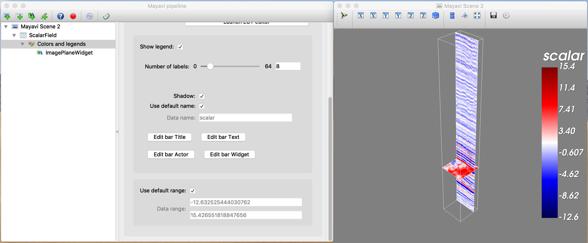

# SEGY 3D Viewer and Header Analysis
> Using Mayavi to Display 3D SEGY Volumes
> and Converting Trace Headers to Pandas Dataframe

Displaying SEGY data (standard data format for seismic data) in Python was not an easy job until Mayavi (a Python visualiztion library) made it possible.

In this Jupyter notebook code, first, I extracted trace header information from a SEGY file and converted that to a Pandas Dataframe. Then I used Mayavi to display traces and the SEGY volume in an interactive 3D environment.

## Running the Code

To run this code, you need JupyterNotebook. 
Also, you need to install Mayavi on your computer (please see https://docs.enthought.com/mayavi/mayavi/installation.html)